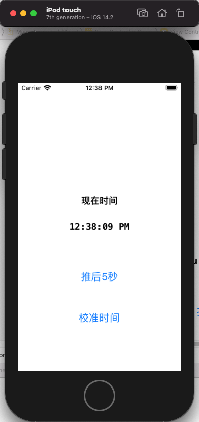

# GWTimeCalibration
a time calibration implementation on iOS with Swift

## 原理
    - 在 APP 启动、APP 从后台返回前台的时候，发送请求给服务器请求校准时间；
    - 服务器返回的毫秒级别的 Unix时间戳
    - 本地 APP 记录 本地时间 和 服务器时间的差值（delta time）
    - 用 Rust 写了个简单的线程池，搭配一个 自制的 HTTP Web Server配合此 Demo

## 设置环境
[安装 Rust](https://www.rust-lang.org/learn/get-started)
## 测试 Demo
    - git clone
    - cd mini_web_server
    - cargo run
    - double click GWTimeCalibration.xcworkspace to run on Xcode